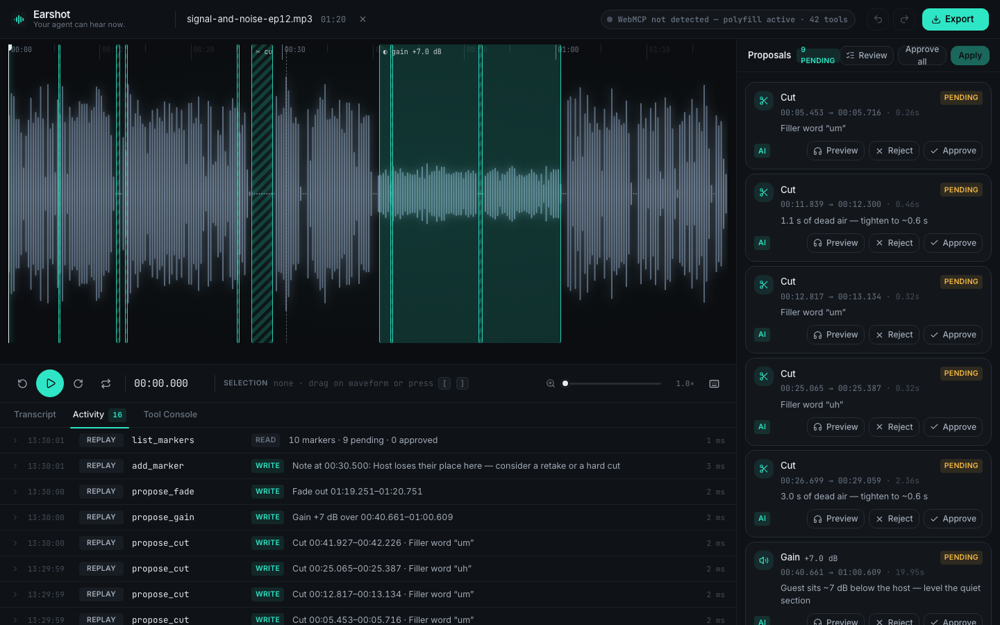
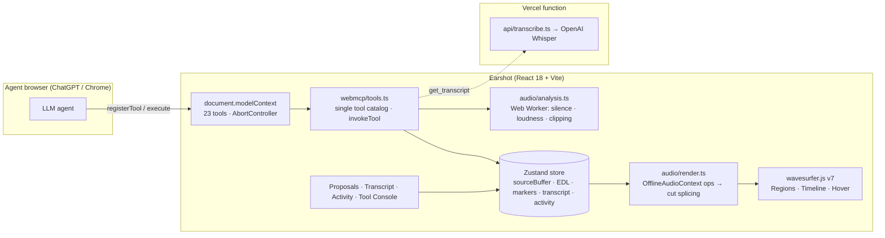

<p align="center">
  
</p>

<h1 align="center">Earshot</h1>
<p align="center"><strong>Your agent can hear now.</strong></p>
<p align="center">
  <a href="LICENSE"></a>
  
  
</p>

Earshot is a browser-based audio editor for podcasters and voice creators where the AI agent can actually **hear** the recording. Through [WebMCP](https://webmachinelearning.github.io/webmcp/) it exposes the editor's ears — silence detection, loudness, clipping, a word-level transcript — and its hands — cut, gain, fade, filter — as first-class tools on `document.modelContext`. The agent listens, **proposes** edits on the timeline, and the human approves them with their own ears before anything is applied. Every edit is non-destructive, undoable, and exportable as WAV. Built for the OpenAI WebMCP Challenge.

<p align="center">
  
</p>

## How it uses WebMCP

The core idea is a **human-in-the-loop edit protocol** expressed as tools:

```
agent: get_status → detect_silences / find_filler_words / compare_speakers   (perception)
agent: propose_cut ×N, propose_gain, propose_fade                            (safe writes → pending markers)
human: Preview · Approve · Reject on the timeline                             (ears)
agent or human: apply_proposals → play → export_audio                        (commit)
```

Proposals are markers, not edits. `apply_proposals` only applies markers the human marked *approved* (unless the user explicitly asks the agent to `force`). Everything the agent does streams into the **Activity** panel with arguments, results and timings, and the WebMCP status pill glows on every call.

Implementation notes (current spec, Sept 2026):

- Tools register on **`document.modelContext.registerTool()`**, awaited, in the **top-level document only** (no iframes, no declarative forms).
- Lifetime is owned by an **`AbortController`** passed as `{ signal }`; it is aborted on unmount and re-created when audio is loaded/closed. No `provideContext`/`clearContext`/`unregisterTool`.
- Before audio is loaded only **`get_status`** is registered; after load the full set of 23 tools appears.
- Every `inputSchema` is a strict JSON Schema object (`additionalProperties: false`, described properties). Read tools carry `readOnlyHint: true`; audio-mutating tools carry `destructiveHint: true`; transcript-derived tools carry `untrustedContentHint: true` (spoken audio can contain prompt-injection text).
- If `document.modelContext` is absent, [`@mcp-b/webmcp-polyfill`](https://www.npmjs.com/package/@mcp-b/webmcp-polyfill) is initialised so the app degrades gracefully and can be tested in plain Chrome.
- All tool times are **seconds on the working timeline** (what you hear after applied cuts). Results always include enough to verify (new duration, ids, counts).

### Tool catalog

| Tool | Access | What it does |
| --- | --- | --- |
| `get_status` | read | File, working/source duration, sample rate, channels, EDL op count, proposal counts, transcript state, selection, playhead. |
| `get_selection` | read | The human's current `{ start, end }` selection and playhead. |
| `get_transcript` | read · untrusted | Word-level transcript (`{ text, start, end }`), plain text and segments; optional range. Triggers Whisper on first call. |
| `find_in_transcript` | read · untrusted | Case-insensitive phrase search → time ranges with context. |
| `detect_silences` | read | Gaps below `threshold_db` (dBFS RMS, 20 ms windows) longer than `min_duration_s`. |
| `get_loudness_profile` | read | Per-window `rms_db`/`peak_db` + integrated, peak and dynamic range (dBFS RMS, not LUFS). |
| `detect_clipping` | read | Runs of samples at/above `threshold` with sample counts. |
| `find_filler_words` | read · untrusted | "um/uh/like/you know/so" hits with confidence and context. |
| `compare_speakers` | read · untrusted | Per-segment loudness (transcript sentences or pause-split), flags quiet/loud spans, suggests gain. |
| `list_markers` | read | Every proposal/note with status `pending · approved · rejected · applied`. |
| `propose_cut` | write · proposal | Pending cut marker with a reason. |
| `propose_gain` | write · proposal | Pending gain change (−24…+24 dB) over a range. |
| `propose_fade` | write · proposal | Pending fade `in`/`out` over a range. |
| `propose_filter` | write · proposal | Pending region-limited `notch` / `highpass` at `frequency_hz`. |
| `add_marker` | write | Plain note at a time; no edit attached. |
| `clear_proposals` | write | Removes all unapplied agent proposals and notes. |
| `apply_proposals` | write · destructive | Applies **approved** proposals (or given `ids`; `force: true` includes pending) to the EDL and re-renders. Undoable. |
| `normalize` | write · destructive | Whole-track normalize to `target_db` (RMS or peak) with a −0.1 dBFS ceiling. |
| `set_selection` | write | Moves the human's selection and scrolls to it ("here is the pause I mean"). |
| `seek` | write | Moves the playhead. |
| `undo` / `redo` | write · destructive | History navigation (EDL + marker statuses). |
| `export_audio` | write | Renders the EDL and downloads 16-bit PCM WAV; returns name, bytes, duration. |

## Try it with ChatGPT / Codex

1. Open the deployed app in the ChatGPT desktop app's built-in browser (GPT-5.6 Sol or Terra): **https://earshot-beige.vercel.app** (or your own deployment).
2. Click **Load demo podcast clip** (or drop your own MP3/WAV/M4A).
3. Click the **Site tools** icon in the address bar — you should see 23 tools with the read/write split.
4. Send:

> Listen to this recording, find the filler words and long pauses, propose cuts, and level the quiet parts.

5. Watch the proposals land on the timeline. Preview them, approve the good ones, reject one, then say *"apply what I approved and export"*.

## Try it in Chrome (no agent needed)

- Enable `chrome://flags/#enable-webmcp-testing` and use any WebMCP-aware extension or the DevTools console (`await document.modelContext.getTools()`), **or**
- Use the built-in **Tool Console** tab: pick a tool, edit the JSON arguments, run it, and read exactly what an agent would receive. The **Activity** tab's *"Replay a sample agent session"* runs a scripted sequence through the same tool path (no model involved) so you can see the loop end to end. `?demo=1` auto-loads the clip; `?demo=agent` also runs the replay.

## Local development

```bash
npm install
cp .env.example .env        # add OPENAI_API_KEY for transcription (optional: the demo clip ships with a transcript)
npm run dev                 # http://localhost:5173 — /api/transcribe is served by a Vite dev middleware
npm test                    # Vitest: EDL time mapping & splicing, WAV encoding, silence/loudness/clipping analysis
npm run build               # tsc + vite build (zero TS errors)
```

### Environment variables

| Name | Where | Purpose |
| --- | --- | --- |
| `OPENAI_API_KEY` | Vercel project / `.env` | Server-only key used by `api/transcribe.ts`. Never shipped to the client. |
| `OPENAI_TRANSCRIBE_MODEL` | optional | Defaults to `whisper-1` (`timestamp_granularities: word`). |

Deploy with `vercel` — `vercel.json` sets the function's `maxDuration` and caches the demo assets. Transcription uploads are 16 kHz mono WAV chunks of ≤ 120 s so every request stays under Vercel's 4.5 MB body limit; results are cached in memory and IndexedDB by file hash.

## Architecture



**Non-destructive by design.** The source `AudioBuffer` is never mutated. Edits live in an ordered Edit Decision List (cut, gain, fade_in, fade_out, normalize, notch_filter, highpass) on the *source* timeline; every change re-renders the working buffer (10 ms automation crossfades for region ops, 5 ms fades at each cut splice) and reloads the waveform. History is a stack of EDL + marker snapshots, so undo/redo is trivial. See [DECISIONS.md](DECISIONS.md) for the reasoning behind each choice.

## License

MIT — see [LICENSE](LICENSE).
